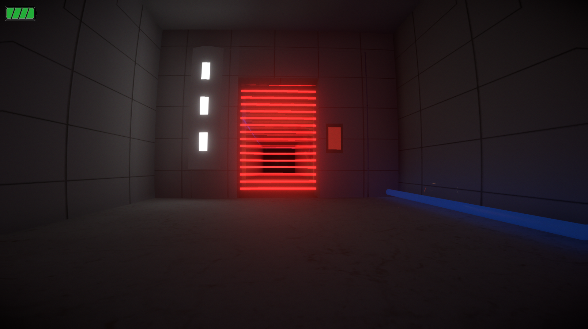
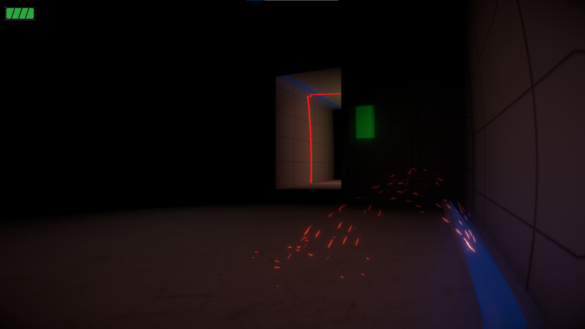
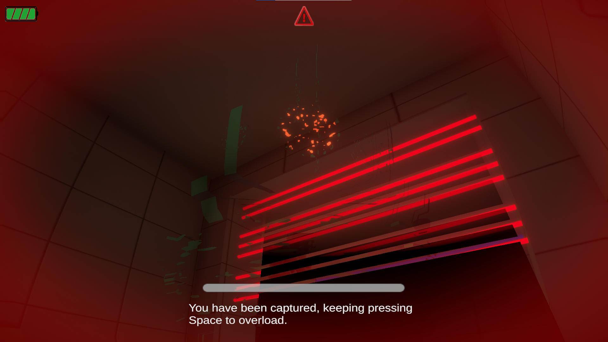
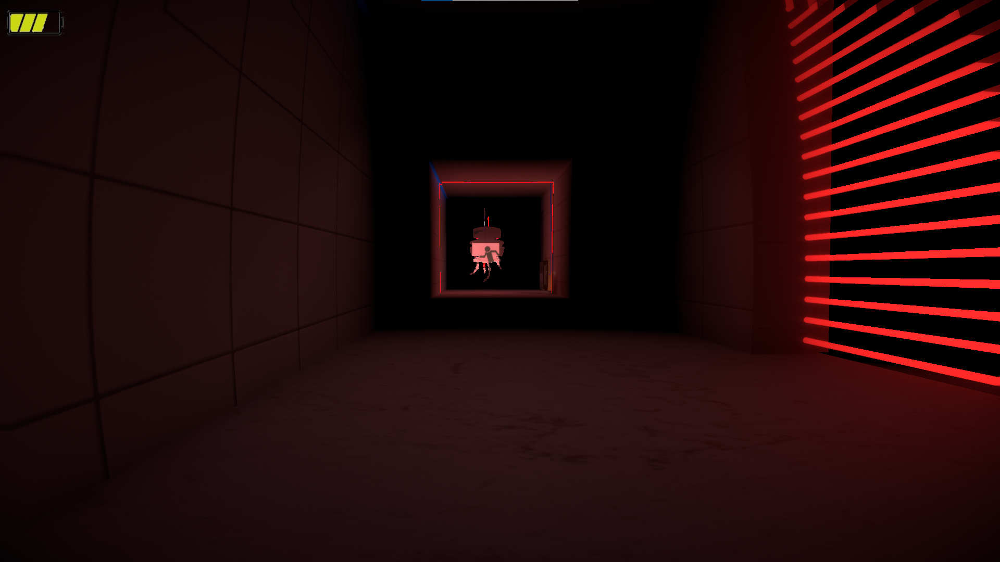

# Wandering Robot

于2023年4月独自制作的一款潜行类小游戏，流程短，玩法简单，但除了音频与贴图外的内容均为自制，主要是为了锻炼3D建模，编写Shader，制作粒子效果等能力

## 基本玩法

第一人称视角，E键与道具交互，同时避开巡逻的敌对机器人，最后在生命值耗尽前抵达终点

- 与敌对机器人的距离小于安全距离时会触发警报
- 按ctrl键进行睡眠，此时不可移动，除非与敌对机器人距离极短，否则不会被追捕
- 玩家视野受限，敌人在正常状态下为透明，只有通过周期性的扫描线效果才可辨认到敌对机器人
- 被抓捕后巡逻机器人会逐渐显形，长按空格键放电逃脱

